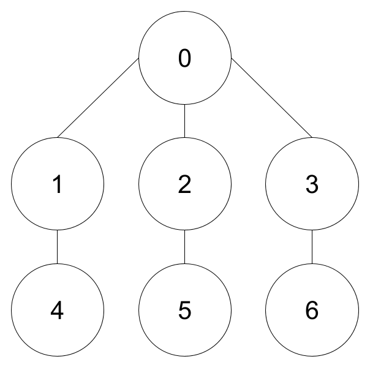
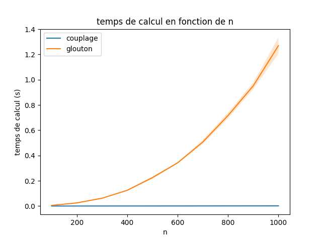
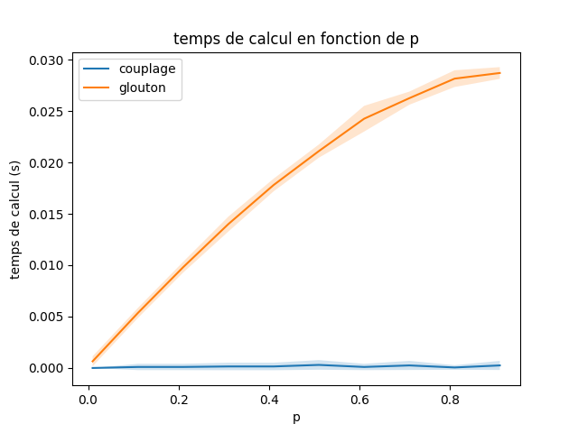
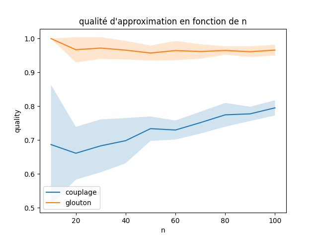

# VERTEX COVER - Rapport

## 1 Introduction

Dans ce projet, nous nous sommes intéressés à l’implémentation d’algorithmes de résolution du problème de **couverture minimum par sommets** (_Vertex Cover_ en anglais). Ce problème consiste à déterminer en ensemble minimum de sommets pour couvrir toutes les arêtes d’un graphe.  
Nous avons choisi de représenter un graphe par une liste de sommets et une liste d’arêtes.
- Les algorithmes peuvent être découpés en 2 catégories:
- les méthodes approchées (couplage et glouton),
- la méthode de branchement (avec ses améliorations).

## 2 Implémentation des méthodes approchées

### 2.1 Optimalité de l’algorithme glouton

Voici l’exemple d’un graphe $G$ pour lequel l’algorithme glouton ne renvoie pas la solution optimale.

    

En effet la solution optimale est $\{1,2,3\}$ et est donc de taille 3. L’algorithme glouton va quant à lui sélectionner le sommet de degré maximum (0) auquel il va ajouter une combinaison de 3 sommets entre [1 ou 4], [2 ou 5] et [3 ou 6]. Il renverra donc une solution de taille 4, qui n’est pas optimale.  
D’après cet exemple, on peut en déduire que l'algorithme glouton n’est pas $r$-approché, pour :

$$r<\frac{gouton(G)}{OPT(G)}=\frac{4}{3}$$

Pour montrer que cet algorithme n’est pas $r$-approché pour tout r, on pourrait trouver un algorithme qui construit un graphe H tel que glouton(H) pourrait renvoyer, s’il fait les pires choix à chaque itération, une solution aussi loin que l’on veut de l’optimale.

## 2.2	Comparaison des méthodes approchées

Pour comparer les temps de calcul de couplage et glouton nous avons mesuré une taille $N_{max}=1000$ de sommets jusqu’à laquelle les algorithmes tournent rapidement. Nous avons généré une vingtaine de graphes pour chaque $n \in \{\frac{N_{max}}{10},\frac{2N_{max}}{10}, . . . ,N_{max}\}$ avec une probabilité $p=\frac{1}{\sqrt{n}}$ pour obtenir des graphes légers (_Fig.1_).

Afin d’analyser l’influence de la probabilité p de présence d’une arête, nous l’avons faite varier de $0.1$ à $0.9$, pour $n=100$ (_Fig.2_).

    
    

Par lecture graphique, on constate que les variations de temps de calcul (en fonction de n comme de $p$) de couplage sont insignifiantes comparées à celles de glouton dont les variations semblent suivre une évolution quadratique en fonction de n et logarithmique en fonction de p.
Ces algorithmes étant des approximations, leur qualité est tout aussi importante que leur vitesse de calcul. C’est pourquoi nous avons comparé leur rapport d’approximation avec la solution exacte, calculée par l’algorithme de branchement amélioré bb_improved2 que nous verrons plus tard. Nous avons réalisé ces tests pour un Nmax de 100 (_Fig.3_).

    

